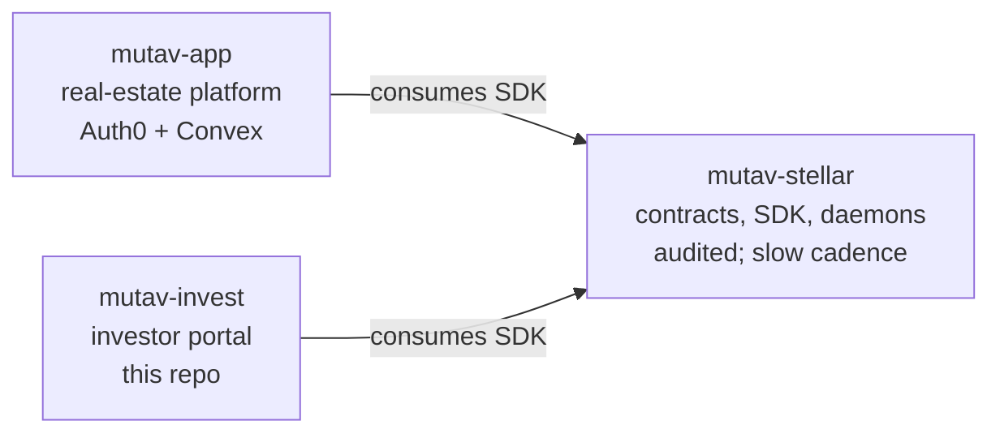

# MUTAV Invest — Investor Portal

Public-facing investor portal for MUTAV Finance: fund data, NAV view, deposit / request-redemption / claim flows. Signs client-side via Stellar wallet.

> *Portal do investidor MUTAV: dados do fundo, NAV, fluxos de aporte/resgate/reivindicação. Assinatura via carteira Stellar.*

## Scope

This repo is the **investor-facing dApp** in MUTAV's three-repo split. It holds **no operator or admin keys** — all signing happens client-side via the user's wallet.

- **Fund data view** — NAV, AUM, yield history, fund overview
- **Investor flows** — deposit, request redemption, cancel, fulfill, reclaim
- **Account view** — investor balance, pending redemption status
- **KYC / onboarding** — if/when required by jurisdiction

## The three-repo split



| Repo | Role |
|---|---|
| [`mutav-finance/mutav-stellar`](https://github.com/mutav-finance/mutav-stellar) | Stellar contracts + TS SDK + operator infrastructure. The audited surface. |
| [`mutav-finance/mutav-app`](https://github.com/mutav-finance/mutav-app) | Real-estate platform (Auth0 + Convex) for agencies. |
| **`mutav-finance/mutav-invest`** (this repo) | Investor portal — public dApp. |

`mutav-invest` consumes the `@mutav-finance/mutav-stellar` SDK to read on-chain state and submit user-signed transactions. No server-side operator/admin keys.

Architecture docs live in `mutav-stellar/docs/architecture/`.

## Stack

- **Next.js 16 (App Router)** + **TypeScript** — frontend
- **Bun** — package manager + scripts
- **Stellar SDK** + **wallet kit** (TBD: Freighter / Albedo / stellar-wallets-kit) — chain interaction + signing

Hosting: Vercel (likely) — Next.js, edge-friendly, fits Vercel ecosystem skills.

## Setup

```bash
git clone https://github.com/mutav-finance/mutav-invest.git
cd mutav-invest
bun install
bun run dev
```

Visit http://localhost:3000.

## License

Apache-2.0. See [LICENSE](./LICENSE) and [NOTICE](./NOTICE).
