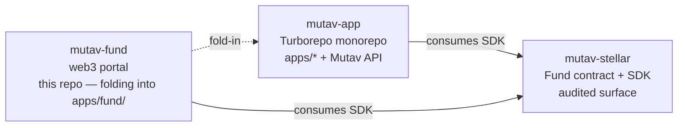

# MUTAV Fund — Web3 Portal

> **⚠️ Soft-deprecated (2026-05-30).** This repo folds into [`mutav-finance/mutav-app`](https://github.com/mutav-finance/mutav-app) `apps/fund/` as part of the Turborepo monorepo migration ([planning ask](https://github.com/mutav-finance/mutav-app/issues/139), [protocol decision](https://github.com/mutav-finance/mutav-stellar/issues/57), [policy](https://github.com/mutav-finance/mutav-fund/issues/11)). Until the migration lands, the repo stays functional — but **no new features here**: open them against `mutav-app` instead. Only critical fixes land in this repo. Archive happens after `apps/fund/` reaches feature parity, not before.

Web3-native portal for the MUTAV fund. Serves both audiences who interact with the fund via wallet-signed transactions:

- **Investors** — deposit USDC, request redemption, claim, view NAV / portfolio / transparency.
- **Protocol team (admin)** — manage the fund: AUM dashboard, partner whitelist, parameter changes, `cover_default`, paused state, admin handover.

All signing happens client-side via the user's Stellar wallet. The portal holds **no operator or admin keys server-side**.

> *Portal web3 nativo do MUTAV — investidores aportam/resgatam e o time de protocolo gere o fundo, tudo via assinatura de carteira do usuário. Nenhuma chave de operador/admin server-side.*

## Scope

### Investor surface (public)
- Fund overview: NAV, AUM, yield history, transparency feed
- Deposit / request redemption / cancel / fulfill / reclaim
- Account view: investor balance, pending and ready redemption state
- KYC / onboarding (if/when required by jurisdiction)

### Fund-management surface (admin, wallet-gated)
- Dashboard: AUM, NAV, total supply, paused state, weekly cap utilization, queue depth, ready-redemption inventory
- Partner whitelist: `set_approved_partner`, view current set
- Parameter changes: `set_*_bps` (mgmt, exit cap, protocol, redemption fees), `set_fulfill_window`, `set_classic_wallet` (two-step once #32 lands)
- Defaults: `cover_default` with destination + amount
- Pause toggle
- Admin handover: `propose_admin` / `accept_admin`
- Read-only observability: recent on-chain events, daemon health (when the indexer #44 lands)

## Repo position (historical — see soft-deprecation note above)



| Repo | Role |
|---|---|
| [`mutav-finance/mutav-stellar`](https://github.com/mutav-finance/mutav-stellar) | Fund contract (Soroban/Rust) + TS SDK. Audited surface. (Operator daemons removed from scope per [`#57`](https://github.com/mutav-finance/mutav-stellar/issues/57); operator runtime moves to KMS-backed Convex Actions on `mutav-app`.) |
| [`mutav-finance/mutav-app`](https://github.com/mutav-finance/mutav-app) | Turborepo monorepo: persona apps + Mutav API (Convex). **The future home of this repo's content** as `apps/fund/`. |
| **`mutav-finance/mutav-fund`** (this repo) | Web3 portal — investor flows + fund management. **Soft-deprecated** pending the fold-in. |

`mutav-fund` consumes the `@mutav-finance/mutav-stellar` SDK to read on-chain state and construct transactions for wallet signing. No server-side keys.

Architecture docs live in `mutav-stellar/docs/architecture/`.

## Stack

- **Next.js 16 (App Router)** + **TypeScript** — frontend
- **Bun** — package manager + scripts
- **Stellar SDK** + **wallet kit** (TBD: Freighter / Albedo / stellar-wallets-kit) — chain interaction + signing

Hosting: Vercel.

## Setup

```bash
git clone https://github.com/mutav-finance/mutav-fund.git
cd mutav-fund
bun install
bun run dev
```

Visit http://localhost:3000.

## Related tools

[**stellar-build**](https://web-nine-umber-74.vercel.app/) — community CLI bundling 42 Stellar-focused Claude skills + 6 personas. Recommended for Soroban/Stellar agent workflows.

```bash
curl -fsSL https://raw.githubusercontent.com/kaankacar/stellar-build/main/install.sh | bash
```

## License

Apache-2.0. See [LICENSE](./LICENSE) and [NOTICE](./NOTICE).
